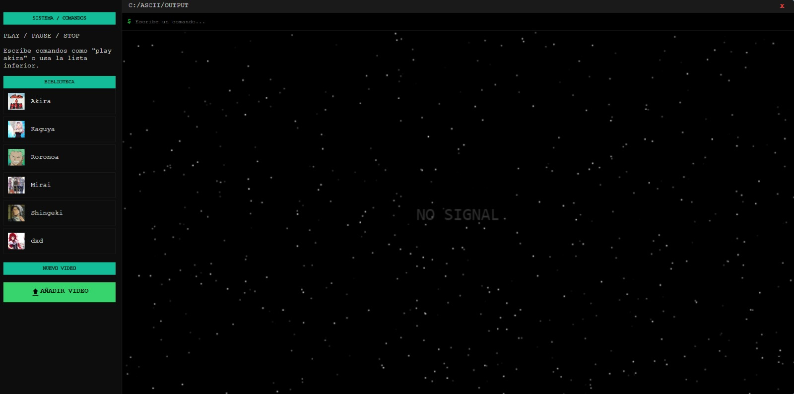
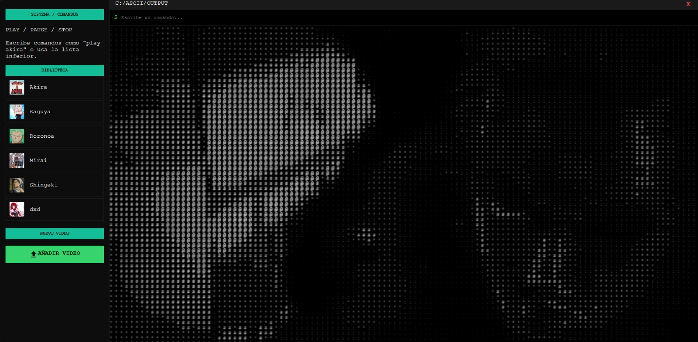

# ASCII Terminal Player 🎬💻

**ASCII Terminal Player** es un sistema de procesamiento de video en tiempo real desarrollado como parte de mi portafolio profesional en **Ingeniería de Sistemas e Informática**. La aplicación transforma flujos de video dinámicos en representaciones artísticas mediante caracteres ASCII, utilizando manipulación directa de matrices de datos de imagen a través de la **Canvas API**.

## 📸 Vista Previa del Sistema

Aquí puedes observar la interfaz principal y el flujo del juego:

<p align="center">
  
  <br>
  <i>Interfaz.</i>
</p>

<p align="center">
  
  <br>
  <i>Interfaz con la reproducción de Roronoa.</i>
</p>


## 🚀 Características Principales

* **Renderizado de Alta Frecuencia:** Algoritmo optimizado para el escaneo de píxeles y conversión a símbolos basada en la luminancia percibida.
* **Interfaz Estilo Terminal:** Consola interactiva integrada que procesa comandos lógicos (`play`, `pause`, `stop`).
* **Biblioteca Dinámica:** Panel lateral organizado para el acceso rápido y gestión de contenido multimedia local.
* **Carga de Archivos Locales:** Capacidad de procesamiento para archivos externos subidos por el usuario.
* **Simulación de "No Signal":** Implementación de ruido aleatorio (estática visual) para mejorar la **Experiencia de Usuario (UX)** durante estados de espera.

## 🛠️ Tecnologías y Herramientas

* **Core:** JavaScript (Vanilla JS) para la lógica de procesamiento.
* **Gráficos:** HTML5 Canvas API (Manipulación de `ImageData`).
* **Maquetación:** CSS3 (Sistemas de Layout mediante Grid y Flexbox).
* **Tipografía:** Google Fonts (**Courier New** para la cuadrícula ASCII y **Nunito** para la UI).
* **Recursos:** Material Icons para una navegación intuitiva.

## ⚙️ Arquitectura y Lógica Técnica

El núcleo del sistema reside en la clase `AsciiEffect`, la cual implementa un pipeline de procesamiento de señales visuales:

1.  **Captura de Datos:** Extracción de matrices de color (`RGBA`) de cada frame del elemento `<video>` mediante el método `getImageData`.
2.  **Procesamiento de Luminancia:** Cálculo del promedio de color (RGB) para determinar la intensidad lumínica de cada celda de la cuadrícula.
3.  **Algoritmo de Mapeo:** Traducción del valor de brillo a una densidad de caracteres específica (ej. `@`, `#`, `*`, `.`).
4.  **Renderizado en Buffer:** Dibujo de los caracteres resultantes en un canvas secundario de alta frecuencia para mantener la fluidez visual.


## 📂 Estructura del Repositorio

Siguiendo estándares de organización de software:

```text
/ReproductorAsciiVideo
├── /Assets
│   ├── /Videos         # Contenido multimedia local
│   ├── /miniaturas     # Previsualizaciones de la biblioteca
│   └── /images         # Recursos visuales e interfaz
├── index.html          # Estructura principal y contenedores
├── style.css           # Estética de terminal retro-minimalista
├── index.js            # Lógica de procesamiento de video y comandos
└── README.md           # Documentación técnica